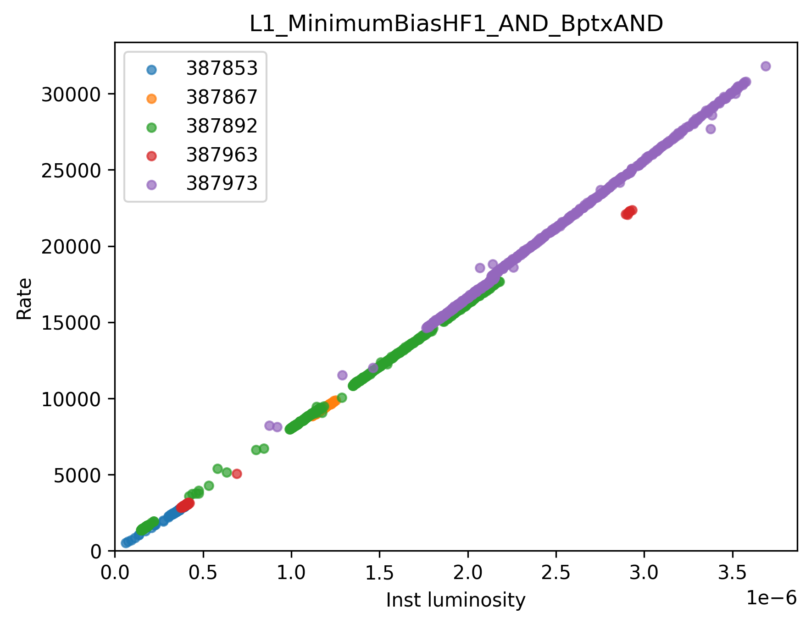

# Trigger rates and counts from OMS

* [Install](#install)
* [Usage](#usage)
    - [ratevsls.py](#ratevsls): Draw rate vs inst lumi
    - [hltcount.py](#hltcountpy): HLT counts in given lumi section ranges of time range
    - [ratetable.py](#ratetablepy): HLT/L1 rates/counts comparison between run or lumi sections

## Install
```
git clone git@github.com:boundino/omstools.git
cd omstools/
```
* Add requirements
    - On private computer
    ```
    python3 -m venv .venv # suggest using virtual environment
    . .venv/bin/activate # activate the env every time you run the macro
    pip3 install -r requirements.txt 
    ```
    - On lxplus8
    ```
    git clone ssh://git@gitlab.cern.ch:7999/cmsoms/oms-api-client.git
    cd oms-api-client
    python3 setup.py install --user
    python3.8 setup.py bdist_rpm --python /usr/bin/python3.8 --build-requires python38,python38-setuptools --release 0.el8
    ```

* Add secret info (ask me) in `env.py`
```
CLIENT_ID = 'example_id'
CLIENT_SECRET = 'example_secret'
```

## Usage
### `ratevsls.py`
* HLT paths or L1 rates or counts for a given set of runs/lumi sections
```
usage: ratevsls.py [-h] --runs RUNS --pathname PATHNAME [--l1postdt] [--outcsv OUTCSV] [--label LABEL] [--unstable]
HLT or L1 rates vs lumi sections for selected runs
Generate a plot of trigger rate vs instantaneous luminosity

options:
  -h, --help           show this help message and exit
  --runs RUNS          run number list
  --pathname PATHNAME  HLT path or L1 seed
  --l1postdt           Optional store L1 post DT rate instead of pre PS rate
  --outcsv OUTCSV      Optional csv output file
  --label LABEL        Optional suffix for output figure and csv file
  --unstable           Include unstable runs and LSs
```
* Example
    - Command
    ```
    python3 ratevsls.py --pathname L1_MinimumBiasHF1_AND_BptxAND --runs 388095,388004,399710,399658,399660
    ```
    - Image
    
* Optional
    - Assign colors
    ```
    python3 ratevsls.py --pathname L1_MinimumBiasHF1_AND_BptxAND --runs 388095:blue,388004:blue,399710:red,399658:red,399660:red
    ```
    
    
    It first checks whether the given color exists in the [Tableau Palette](https://matplotlib.org/stable/gallery/color/named_colors.html#tableau-palette).
    If it's not found there, it falls back to the corresponding name in the [CSS Colors](https://matplotlib.org/stable/gallery/color/named_colors.html#css-colors).
    Different runs may share the same color, which can sometimes make the results easier to interpret.

### `hltcount.py`
* Print event counts of HLT or stream in given lumi ranges 
```
usage: hltcount.py [-h] (--lumiranges LUMIRANGES | --timerange TIMERANGE) --pathnames PATHNAMES [--outcsv OUTCSV]
Print HLT counts or number of events in a stream in given lumi ranges of runs
options:
  -h, --help            show this help message and exit
  --lumiranges LUMIRANGES
                        (option 1) <min_run>(:<LS>)-<max_run>(:<LS>) e.g. 374763-374778,374797-374834; (option 2) cert json file
  --timerange TIMERANGE
                        (option 3) <start_time>,<end_time>
  --pathnames PATHNAMES
                        List of HLT paths or stream names, (option 1) HLT_1,PhysicsHIPhysicsStream_1,HLT_2; (option 2) .txt file with each line as an HLT path or stream name
  --outcsv OUTCSV       Optional csv output file
```
* Example 1 (Use lumiranges)
    - Command
    ```
    python3 hltcount.py --lumiranges 374763-374778,374797-374834 --pathnames HLT_HIMinimumBiasHF1ANDZDC1nOR_v1,HLT_HIMinimumBiasHF1AND_v3
    ```
    - Screen
    ```
    Write to output file: outcsv/hltcount.csv
    Extracting lumisections with stable beams...
    Summing up lumi sections: {'374763': [[68, 106]], '374764': [[1, 31]], '374765': [[1, 28]], '374766': [[1, 34]], '374767': [[1, 32]], '374768': [[1, 31]], '374778': [[36, 287]], '374803': [[5, 592]], '374804': [[1, 14]], '374810': [[49, 1748]], '374828': [[24, 66]], '374833': [[67, 304]], '374834': [[1, 12]]}
    ------------------------------------------------------
    | HLT Path                          |          Count |
    ------------------------------------------------------
    | HLT_HIMinimumBiasHF1ANDZDC1nOR_v1 |     1031991933 |
    | HLT_HIMinimumBiasHF1AND_v3        |         811481 |
    ------------------------------------------------------
    ```

* Example 2 (Use json)
    - Command
    ```
    python3 hltcount.py --lumiranges examples/Cert_Collisions2022HISpecial_362293_362323_Golden.json --pathnames HLT_HIMinimumBias_v2
    ```
    - Screen
    ```
    Write to output file: outcsv/hltcount.csv
    Summing up lumi sections: {'362294': [[1, 53]], '362296': [[1, 59]], '362297': [[1, 199]], '362315': [[46, 96]], '362316': [[1, 18]], '362317': [[1, 11]], '362318': [[1, 58]], '362319': [[1, 24], [30, 50], [60, 66]], '362320': [[1, 193]], '362321': [[1, 356]], '362322': [[1, 31]], '362323': [[1, 416], [447, 590]]}
    -----------------------------------------
    | HLT Path             |          Count |
    -----------------------------------------
    | HLT_HIMinimumBias_v2 |       34031546 |
    -----------------------------------------
    ```

* Example 3 (Use time range)
    - Command
    ```
    python3 hltcount.py --timerange 2023-09-19T19:00,2023-09-20T05:00 --pathnames HLT_ZeroBias_v8,HLT_PPRefGEDPhoton40_v1,HLT_AK4PFJet100_v1
    ```
    - Screen
    ```
    Write to output file: outcsv/hltcount.csv
    Extracting lumisections with stable beams...
    Summing up lumi sections: {'373710': [[7, 832]]}
    --------------------------------------------
    | HLT Path                |          Count |
    --------------------------------------------
    | HLT_ZeroBias_v8         |         381927 |
    | HLT_PPRefGEDPhoton40_v1 |          44933 |
    | HLT_AK4PFJet100_v1      |          83279 |
    --------------------------------------------
    ```

### `ratetable.py`
* HLT paths or L1 rates or counts for a given set of runs/lumi sections
```
usage: ratetable.py [-h] --runls RUNLS --pathnames PATHNAMES [--l1preps] [--count] [--outcsv OUTCSV]

options:
  -h, --help            show this help message and exit
  --runls RUNLS         List of run with optional lumi section, e.g. 373710,373710:740
  --pathnames PATHNAMES
                        List of HLT paths or L1 seeds, (option 1) HLT_1,L1_1,L1_2 (option 2) .txt file with each line as an HLT/L1
  --l1preps             Optional store L1 pre PS rate instead of post DT rate
  --count               Optional store count instead of rate
  --outcsv OUTCSV       Optional csv output file
```
* Example
    - Command
    ```
    python3 ratetable.py --runls 373664,373710,373710:740 --pathnames examples/l1hlt.txt
    ```
    or equivalently
    ```
    python3 ratetable.py --runls 373664,373710,373710:740 --pathnames HLT_AK4CaloJet100_v1,HLT_AK4PFJet100_v1,HLT_PPRefDmesonTrackingGlobal_Dpt60_v1,HLT_PPRefEle50Gsf_v1,HLT_PPRefGEDPhoton60_v1,HLT_PPRefZeroBias_v1,L1_DoubleMuOpen,L1_ZeroBias,L1_SingleJet60 
    ```
    - Screen
    ```
    Variable option: rate
    L1 rate option: Post-DT after PS
    
    Write to output file: outcsv/ratetable.csv
                                                                                    [Hz]
    ------------------------------------------------------------------------------------
    | Path / L1 seed                         |      373664 |      373710 |  373710:740 |
    ------------------------------------------------------------------------------------
    | HLT_AK4CaloJet100_v1                   |       0.046 |       4.758 |       4.676 |
    | HLT_AK4PFJet100_v1                     |        0.02 |       4.148 |       3.904 |
    | HLT_PPRefDmesonTrackingGlobal_Dpt60_v1 |         0.0 |       0.128 |       0.129 |
    | HLT_PPRefEle50Gsf_v1                   |         0.0 |       0.124 |       0.086 |
    | HLT_PPRefGEDPhoton60_v1                |       0.008 |       0.526 |       0.686 |
    | HLT_PPRefZeroBias_v1                   |       7.907 |   18515.109 |    19887.81 |
    | L1_DoubleMuOpen                        |         0.0 |      90.062 |      90.215 |
    | L1_ZeroBias                            |       7.989 |   19731.539 |   19887.299 |
    | L1_SingleJet60                         |       0.856 |      74.919 |      71.726 |
    ------------------------------------------------------------------------------------
    ```
    
